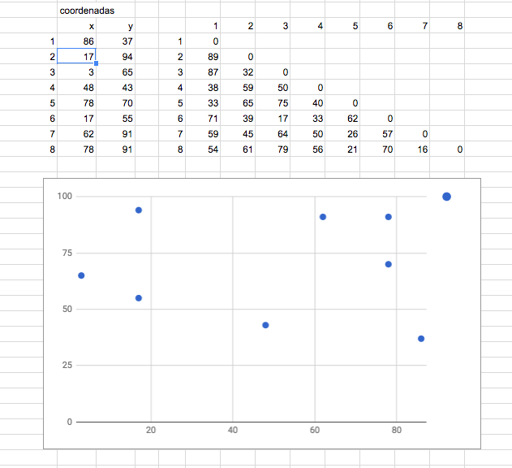

# Travelling Salesman Problem (TSP)

The following figure shows the coordinates and distance matrix of an 8-city symmetric TSP. 
Points are shown graphically. The distance matrix are integer values.

The homework consists on applying the nearest insertion heuristic, 
showing ALL calculations and decisions taken by the algorithm, 
in a very ORGANIZED way, at each iteration. 
Please show all your work and typeset it in an electronic document.
