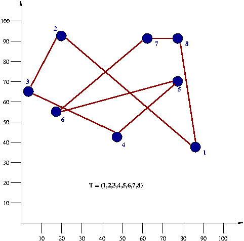

# Local search heuristic

In Homework 4, you must apply the 2-OPT local search heuristic as explained in class.
You must show and typeset your work in an appropriate electronic document illustrating with detail EACH step of the local search heuristic,
showing clearly all computations and what decision the heuristic takes.
2-OPT must be iteratively applied until a local optimal solution has been reached.
You must do two parts: (a) using a BF strategy and (b) using a FF strategy.

To this end, you will use the 8-city example.
The distance matrix is displayed (only the lower triangular part is shown because it is symmetric).
You will start the local search with the following tour T=(1,2,3,4,5,6,7,8) as depicted in the attached figure.

